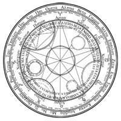

This is a training for creating an AR app with Vuforia.

Please scan the following target images.

Due to GitHub constarints, the following files are removed.
/Assets/wood_textures/wood_dark_002_Color_4K.tif
/Assets/wood_textures/wood_dark_002_Normal_4K.tif
/Packages/com.ptc.vuforia.engine-10.13.3.tgz

Please refer to .gitignore file for details.
